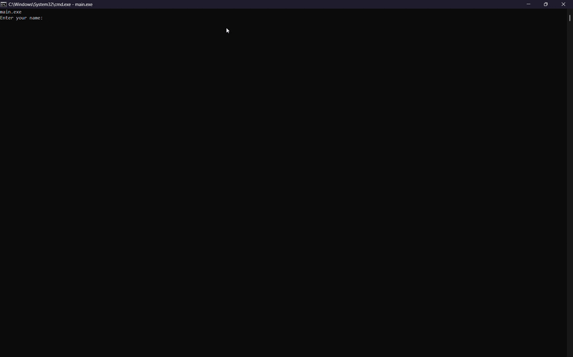
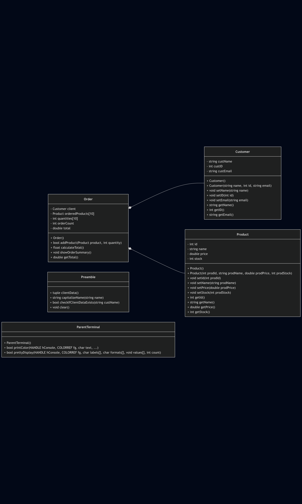
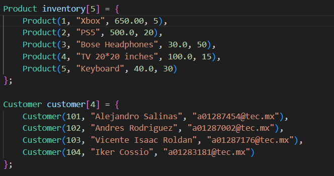
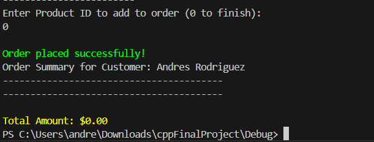
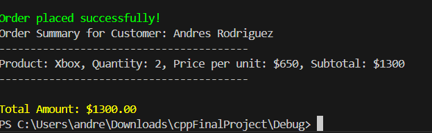
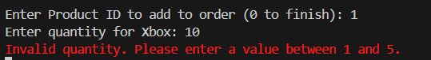
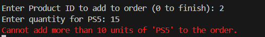
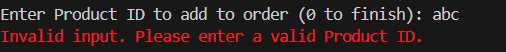

# Session 10 - Problem Situation solution and delivery
# Capstone Project: E-Commerce System for SMEs in Latin America
By Alejandro Salinas Salas and Andrés Rodríguez Cantú

Under the direction of Dr. Kingsley Okoye.

## Problem
Approach a small and medium-sized enterprises (SMEs) in LATAM that struggle to adapt quickly to the digital shift, lacking basic digital management systems to handle online transactions, product catalogs, and customer orders.

Your role as a software developer is to contribute to the  transformation of the SME enterprise and LATAM regional growth by designing and implementing an e-commerce platform prototype using Object-Oriented Programming (OOP) in C++. This prototype will serve as a foundation for the SME’s transitioning from traditional to digital commerce.

# Project Description
We developed a command-line interface (CLI) application that serves as a template for product management. This solution is tailored for SMEs seeking rapid deployment of digital tools. The final product is user-friendly, requiring minimal terminal experience—users simply enter their credentials to register client purchases and calculate transaction totals. Key design choices focus on a robust user experience and an easily extensible codebase, making future enhancements straightforward and easily maintainable for any programmer with decent experience with C++.

### Project Demo


Video Link: https://youtu.be/mE8QDsLMNm8

## Technical aspects of the codebase
### Code style
The coding style we mainly used on the project was object oriented programming (OOP), however, we also made use functional and procedural programming for main. We designed our codebase this way in order to simplify the ammount of work we needed to do when we actually needed to form from our structures to the actual product. 

### Our classes
The entire project relies on these five classes: `Preamble`, `Customer`, `Product`, `Order`, and `ParentTerminal`. `Order` is a composition of `Product` and `Customer`; having a "has-a" relationship between the objects. The structure allows us to perform some aggregiation behaviour by doing in-between classes certian operations (e.g: the total calculation to establish the final price) between product and order. 



The `Preamble` and `ParentTerminal` classes serve as abstractions. `Preamble` handles credential management, including input capture and normalization, while `ParentTerminal` provides a simplified interface for interacting with the WIN32 API, allowing the use of its features without directly dealing with the complexities of the library.

### Array classes
In order to store our data on a class, we made two class arrays; one for customers, and one for items in main. They have a differentiable ID for each and every class made on the array. While it is hardcoded, it is a simple fix to perform in order to add more products and people into the operation.


## Test cases
In order to seek out the functionality of our software, we will demonstrate a couple of scenarios that may occur during production

1.- An empty order



2.- Single valid product



3.- Multiple products  


4.- Invalid product ID


5.- Insufficient stock



6.- Maximum order items reached



7.- Non-integer entered for product ID



## Expandibility
Even tough CLI applications are great, we understand that they are not the most user friendly applications. In order to make this project more user friendly, we could implement a GUI interface within the terminal or even using a window framework in the future to create a regular app. This would allow us to create a more intuitive and visually appealing interface for users to interact with the e-commerce system.

## Reflection
This project has been a great learning experience, as it allowed us to apply the concepts learned throughout the course in a practical manner. We gained hands-on experience with object-oriented programming, class design, and code organization. Additionally, we improved our problem-solving skills by addressing real-world challenges faced by SMEs in Latin America.

## Build
In order to build, you need to have VS2022 (or higher) cpp toolchain in combination to g++. 

```
mkdir build
cd build
cmake ..
cmake --build .
cd..
cd Debug
main.exe
```